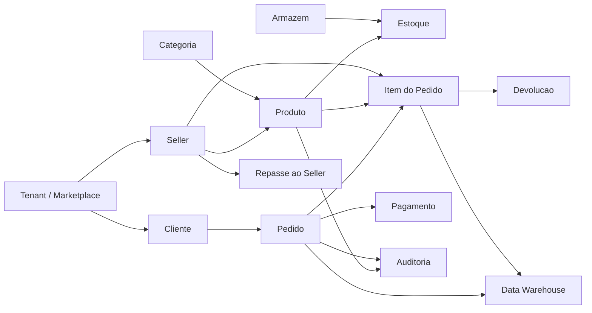

# Arquitetura do Banco de Dados

## Visao Geral

O MercadoNexa Marketplace Analytics foi modelado como uma plataforma de marketplace multi-tenant, com operacao transacional OLTP e uma camada analitica simplificada em estrela.

O banco foi separado em schemas por dominio para reduzir acoplamento, facilitar manutencao e demonstrar uma organizacao comum em sistemas corporativos:

| Schema | Responsabilidade |
| --- | --- |
| `core` | Tenants, clientes, enderecos e sellers |
| `catalog` | Categorias, produtos, precos e versionamento de catalogo |
| `fulfillment` | Armazens, estoque e movimentacoes |
| `sales` | Pedidos, itens, pagamentos, status e devolucoes |
| `finance` | Repasses financeiros aos sellers |
| `audit` | Auditoria generica particionada |
| `staging` | Area de ingestao de eventos brutos |
| `dw` | Data warehouse simplificado |

## Diagrama Conceitual



## Diagrama Logico

O modelo logico usa entidades normalizadas ate 3FN nos fluxos OLTP:

- `core.tenants` centraliza isolamento multi-tenant.
- `core.customers` representa compradores e usa `core.customer_addresses` para evitar atributos repetidos.
- `core.sellers` representa vendedores com status, segmento e taxa de comissao.
- `catalog.categories` usa auto-relacionamento para hierarquia de categorias.
- `catalog.products` pertence a um seller e a uma categoria.
- `catalog.product_price_history` guarda historico temporal de preco e custo.
- `fulfillment.inventory` representa posicao de estoque por produto e armazem.
- `fulfillment.inventory_movements` registra fatos de movimentacao para rastreabilidade.
- `sales.orders` representa o cabecalho do pedido.
- `sales.order_items` resolve a relacao N:N entre pedidos e produtos.
- `sales.payments` permite conciliacao financeira por pedido.
- `sales.returns` registra devolucoes por item.
- `finance.seller_payouts` consolida repasses por seller e periodo.
- `audit.audit_log` registra alteracoes em tabelas criticas.
- `dw.dim_*` e `dw.fact_order_items` criam um modelo estrela para BI.

## Diagrama Relacional

O arquivo [`DER.png`](DER.png) contem o DER visual do projeto.

Resumo das principais cardinalidades:

| Relacionamento | Cardinalidade | Justificativa |
| --- | --- | --- |
| Tenant -> Customers | 1:N | Um marketplace/tenant possui muitos clientes |
| Tenant -> Sellers | 1:N | Cada tenant gerencia varios sellers |
| Seller -> Products | 1:N | Um seller publica varios produtos |
| Category -> Products | 1:N | Uma categoria agrupa varios produtos |
| Category -> Category | 1:N | Categorias podem ter subcategorias |
| Warehouse -> Inventory | 1:N | Um armazem tem varias posicoes de estoque |
| Product -> Inventory | 1:N | Um produto pode existir em varios armazens |
| Customer -> Orders | 1:N | Um cliente realiza varios pedidos |
| Order -> Order Items | 1:N | Um pedido contem varios itens |
| Product -> Order Items | 1:N | Um produto pode aparecer em varios pedidos |
| Order -> Payments | 1:N | Um pedido pode ter mais de uma tentativa/pagamento |
| Order Item -> Returns | 1:N | Um item pode gerar eventos de devolucao |
| Seller -> Payouts | 1:N | Um seller recebe repasses por periodo |

## Decisoes de Modelagem

### Multi-tenant

As principais tabelas possuem `tenant_id`. O arquivo `security.sql` ativa Row Level Security em tabelas sensiveis, usando a setting de sessao `app.current_tenant_id`.

Isso simula um padrao real de SaaS:

```sql
SET app.current_tenant_id = '11111111-1111-1111-1111-111111111111';
```

### Soft Delete

Entidades importantes possuem `deleted_at`. Essa escolha preserva historico, evita perda de trilha de auditoria e permite restauracao ou investigacao posterior.

### Auditoria

O schema `audit` usa trigger generica que grava:

- schema e tabela alterada
- operacao (`I`, `U`, `D`)
- chave primaria textual
- JSON antigo
- JSON novo
- usuario responsavel
- timestamp

A tabela `audit.audit_log` e particionada por `changed_at`, o que reduz custo de consultas em bases grandes.

### Historico de Precos

`catalog.product_price_history` evita sobrescrever preco e custo. A tabela permite analises temporais como:

- margem por periodo
- variacao de preco
- comparacao entre preco vigente e preco no momento da venda

Um indice parcial garante somente um preco corrente por produto.

### Estoque

O estoque foi modelado por armazem e produto:

```text
warehouse + product = posicao de estoque
```

Isso permite:

- disponibilidade regional
- alerta de estoque de seguranca
- historico de movimentacao
- auditoria de baixas, ajustes, devolucoes e compras

### Pedido e Itens

`sales.order_items` resolve a relacao N:N entre pedidos e produtos. O item tambem guarda `unit_price`, `unit_cost` e `commission_rate` no momento da compra, porque esses valores podem mudar no catalogo.

Essa escolha preserva consistencia historica.

### Data Warehouse

O schema `dw` usa modelo estrela:

- `dw.dim_date`
- `dw.dim_customer`
- `dw.dim_product`
- `dw.dim_seller`
- `dw.fact_order_items`

O grain da fato e um item de pedido aprovado/pago/entregue. Isso permite metricas como receita, margem, comissao, quantidade vendida e ticket medio.

## Estrategias de Performance

### Indices Compostos

Foram criados indices alinhados aos filtros de uso real:

- `sales.orders (tenant_id, order_date DESC, order_status)`
- `sales.orders (tenant_id, customer_id, order_date DESC)`
- `sales.order_items (tenant_id, seller_id, product_id)`

### Indices Parciais

Foram usados para reduzir tamanho e custo em consultas frequentes:

- pedidos pagos/ativos
- estoque abaixo do safety stock
- preco corrente de produto

### BRIN

`sales.orders.order_date` usa indice BRIN, indicado para tabelas grandes com dados naturalmente ordenados por tempo.

### GIN

Usado em:

- busca textual de produtos
- JSONB da auditoria
- payload bruto da staging

### Materialized View

`dw.mv_monthly_seller_performance` foi criada para dashboard mensal de sellers. Em producao, o refresh poderia ser agendado apos a carga incremental do DW.

## Fluxo OLTP

1. Cliente faz pedido.
2. Procedure `sales.sp_place_order` valida cliente, produto e estoque.
3. Estoque e bloqueado com `SELECT FOR UPDATE`.
4. Pedido, itens e pagamento sao criados.
5. Estoque e baixado.
6. Triggers recalculam totais e registram historico.
7. Auditoria captura alteracoes criticas.

## Fluxo OLAP / BI

1. Eventos brutos chegam em `staging.raw_order_events`.
2. Procedure `dw.sp_refresh_sales_mart` carrega dimensoes.
3. Fatos de pedidos sao inseridos em `dw.fact_order_items`.
4. Views e materialized views alimentam relatorios e dashboards.

## Compatibilidade

O projeto usa PostgreSQL como tecnologia principal. Para outros bancos:

| Recurso | PostgreSQL | MySQL | SQL Server |
| --- | --- | --- | --- |
| CTE | Nativo | Nativo 8+ | Nativo |
| Window Functions | Nativo | Nativo 8+ | Nativo |
| JSON | `JSONB` | `JSON` | `NVARCHAR`/JSON functions |
| RLS | Nativo | Adaptar via views/procedures | Nativo |
| Partial Index | Nativo | Adaptar com generated columns | Filtered index |
| BRIN | Nativo | Sem equivalente direto | Columnstore/partition |
| `generate_series` | Nativo | Recursive CTE | Tally table/sequence |
| PL/pgSQL | Nativo | SQL/PSM | T-SQL |
